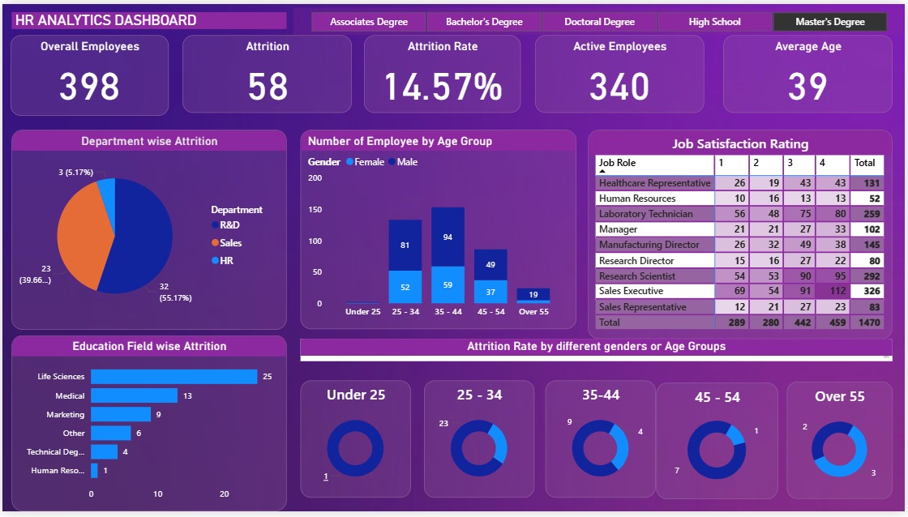

# HR_Analytics

This project showcases a full HR Analytics dashboard built in **Power BI**, focusing on headcount tracking, attrition rate, department-wise performance, and employee distribution. It walks through data cleaning, modeling, DAX measures, and professional visual design.

---

## 🔧 Tools & Techniques

- **Power BI** – For building dashboards and visual reports  
- **Power Query** – Data cleaning, merging, and transformation  
- **DAX** – Custom measures like attrition %, headcount by period, MoM changes  
- **Power BI Service** – For publishing and scheduling refreshes  

---

## Included Files

- `HR_DASHBOARD.pbix` – Complete Power BI dashboard file  
- `HR_DASHBOARD_POWERBI.jpg` – Dashboard screenshot preview  
- `README.md` – Project documentation  

---

## Dashboard Highlights

- Tracks key HR metrics like total headcount, attrition rate, and department-wise trends  
- Interactive visuals with slicers by department, job role, and location  
- Drill-through analysis to explore employee-level details  
- DAX-based calculations for monthly trends and year-to-date performance  
- Built with a professional layout and optimized for usability  

---

## Skills Demonstrated

- Power BI (Advanced DAX, interactive visuals)  
- Power Query for transforming raw HR data  
- Data modeling and relationships between multiple tables  
- Building drill-down and drill-through reports  
- Dashboard automation and refresh setup  

---

## Dashboard Preview

  

---

## How to Use

1. Clone/download the repository: [HR_ANALYTICS](https://github.com/aditipatel89/HR_ANALYTICS)  
2. Open `HR_DASHBOARD.pbix` in Power BI Desktop  
3. Explore the visuals, filters, and DAX measures  
4. Replace or connect new HR data as needed  

---

## Author

**Aditi Patel** – Data Analyst | Power BI Developer  
📫 [LinkedIn Profile](https://www.linkedin.com/in/aditi-patel89/)

---

## otes

- Sample HR data used for demonstration purposes  
- Based on a complete Power BI tutorial for end-to-end dashboarding  
